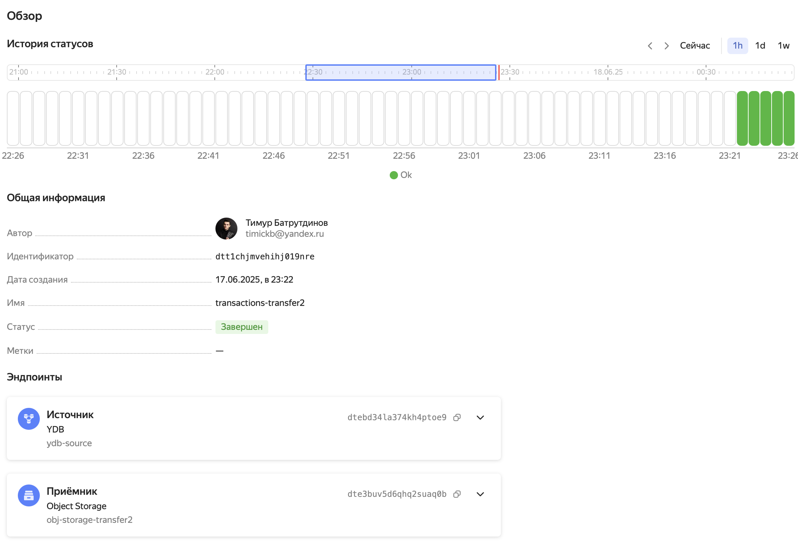

# Трансфер данных из YDB в Object Storage

Отчет:
1. Скачал датасет `transactions_v2` с kaggle
2. Создал сервер Yandex Database, завел там таблицу:
```sql
CREATE TABLE transactions_v2 (
  msno Utf8,
  payment_method_id Int32,
  payment_plan_days Int32,
  plan_list_price Int32,
  actual_amount_paid Int32,
  is_auto_renew Bool,
  transaction_date Uint32,
  membership_expire_date Uint32,
  is_cancel Bool,
  PRIMARY KEY (msno, transaction_date)
);

```
3. Загрузил данные из датасета в эту таблицу:
```bash
ydb                                                                                        --endpoint grpcs://ydb.serverless.yandexcloud.net:2135 \
--database /ru-central1/b1g7r0rgindmq8h3ndfp/etnqufilhqh8ons1q76u \
--sa-key-file authorized_key.json \
import file csv \
--path transactions_v2 \
--delimiter "," \
--skip-rows 1 \
--null-value "" \
transactions_v2.csv
```

4. Настроил и запустил трансфер YDB -> Object Storage:

